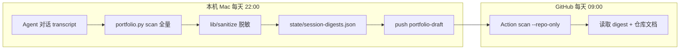

# 本机每日对话同步（脱敏摘要）

> 原始 Agent 对话留在本机 `~/.cursor/projects`，**不会**推送到 GitHub。  
> 入库的是 `state/session-digests.json` 中的**脱敏摘要**（任务描述、结果概要、文件名）。

## 方案概览



| 步骤 | 做什么 |
|------|--------|
| 1. 本机定时任务 | 全量 `scan`：扫仓库 + 对话，对话经脱敏后写入 `session-digests.json` |
| 2. 推送 draft | `scripts/daily-local-sync.sh` 提交并 push `portfolio-draft` |
| 3. 云端 Action | `--repo-only` 读取已推送的 digest，更新案例卡中的「近期协作摘要」 |

电脑关机时：云端仍扫仓库；对话摘要用**上次本机推送**的 digest（可能晚一天）。

## 脱敏规则（自动）

`scripts/lib/sanitize.py` 会处理：

- 邮箱、手机号、身份证号、长数字串
- API Key / Token / `sk-` / `ghp_` / `password=` 等
- 本机绝对路径（仅保留文件名或 `AI Projects/相对路径`）
- 含「密码 / token / 身份证」等关键词的任务**整段跳过**，不写入案例

**不会推送**：原始 `.jsonl` transcript、完整用户路径、密钥原文。

## 安装本机每日任务（macOS）

```bash
cd "/Users/mac/Library/CloudStorage/OneDrive-个人/AI Projects/Cursor案例库"
chmod +x scripts/daily-local-sync.sh

# 复制并编辑 plist 中的仓库路径（如与默认不同）
cp templates/com.cursor.portfolio-daily-sync.plist ~/Library/LaunchAgents/
launchctl load ~/Library/LaunchAgents/com.cursor.portfolio-daily-sync.plist
```

默认每天 **22:00**（北京时间）执行。digest 推送后，**次日 09:00** 云端 Action 会合并进案例卡。

日志：`state/logs/daily-sync-YYYYMMDD.log`

### 手动跑一次

```bash
./scripts/daily-local-sync.sh
```

或仅扫描不入库推送：

```bash
python3 scripts/portfolio.py scan
```

## 对话仍对不上项目？

1. 尽量在 **对应子项目文件夹** 下打开 Cursor（不要只在案例库根目录聊）
2. 无文档的临时任务：在该项目加轻量 `.cursor/ai-impact.yaml`
3. 查看 `inbox/*-scan.json` 的 `unmapped_count`

## 确认发布前

脱敏是自动规则，**不能替代人工判断**。对外 `确认 portfolio` 前请再检查案例卡是否含未公开业务数据。
